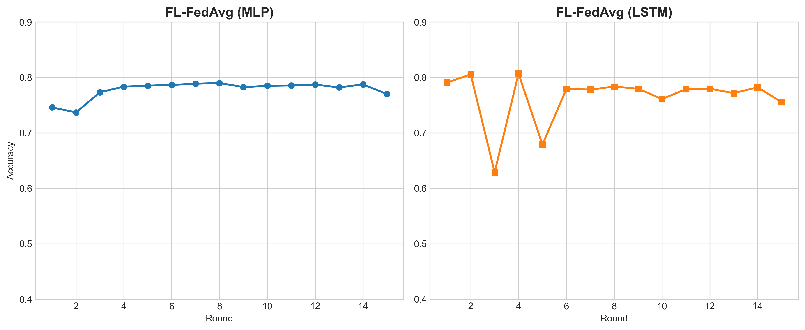
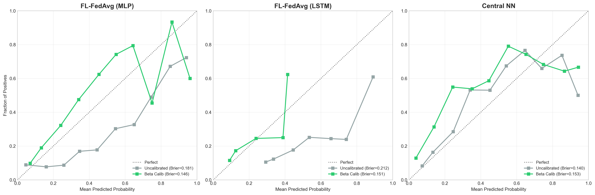
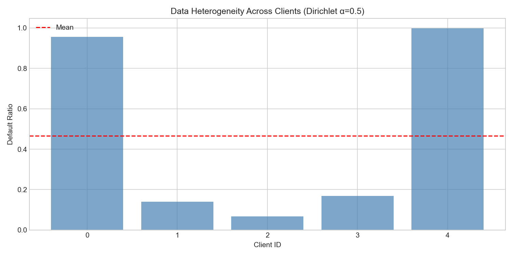
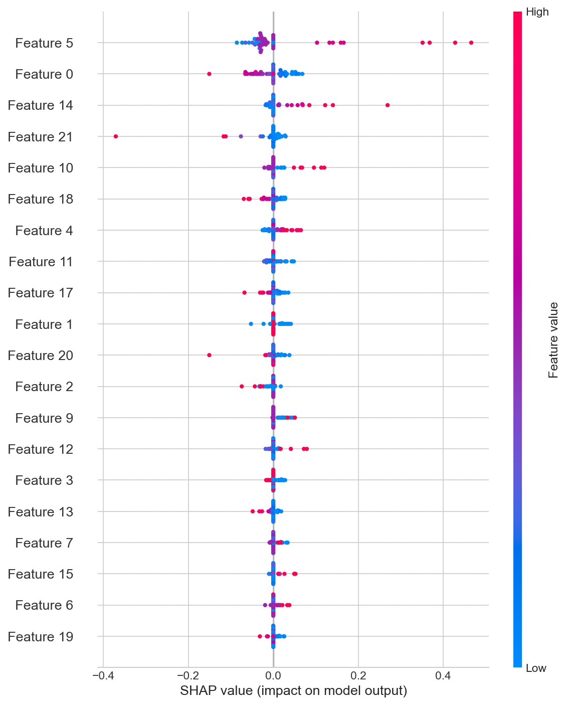
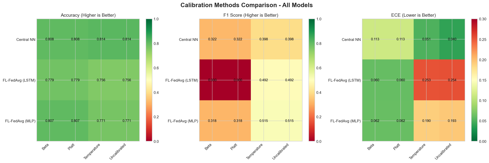
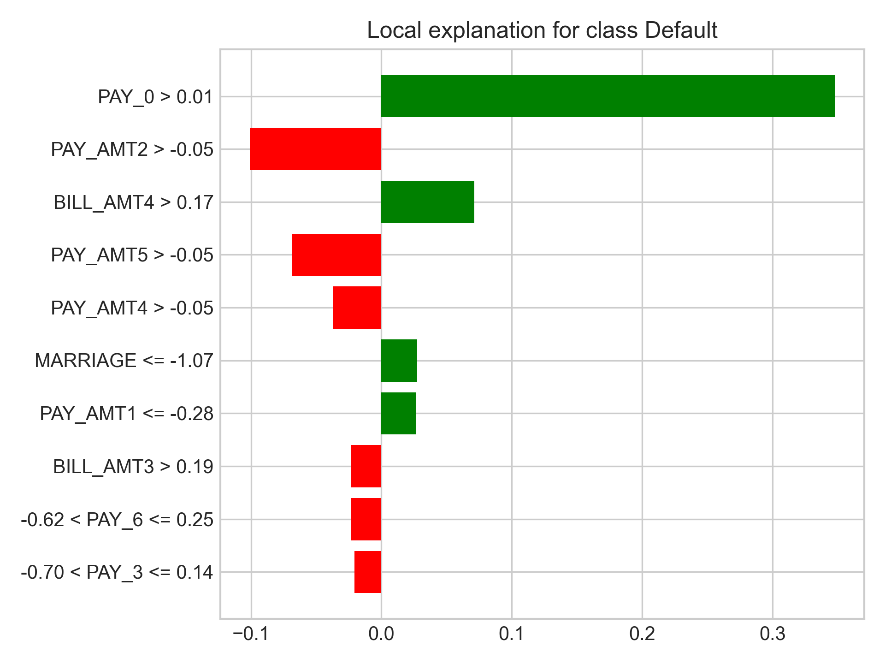

# 🎓 Fintech_Foxes: Privacy-Preserving Federated Credit Scoring

**A Comprehensive Tutorial for Understanding and Presenting Federated Learning Research**

---

**Date:** January 16, 2026  
**Author:** [Hao Lin, Mohamed Badawy, Eray Dogan, Abdelrahman ElKoussy]  
**Mentor:** [David Jin, Dr. Ing Daniel Kriste]
**Github:** https://github.com/Mike-0619/Fintech_Foxes

---

## 📚 Purpose & Audience

This guide is designed for **anyone presenting this project**, regardless of prior knowledge. Whether you're:
- A student presenting in class
- A researcher presenting at a conference  
- A developer explaining to stakeholders
- Someone who has never heard of federated learning before

**You will find everything you need here, explained from first principles.**

---

## 📋 Table of Contents

### Part I: Foundation Concepts (For Complete Beginners)
1. [What is Credit Scoring & Why It Matters](#1-what-is-credit-scoring)
2. [The Privacy Crisis in Banking](#2-the-privacy-crisis)
3. [Introduction to Federated Learning](#3-federated-learning-basics)
4. [Why Neural Networks Need Calibration](#4-calibration-fundamentals)

### Part II: Technical Deep Dive
5. [Dataset & Features Explained](#5-dataset-analysis)
6. [Model Architectures in Detail](#6-model-architectures)
7. [Calibration Methods: Complete Guide](#7-calibration-methods)
8. [Non-IID Data & Dirichlet Partitioning](#8-non-iid-data)
9. [Hyperparameter Optimization with Optuna](#9-hyperparameter-tuning)

### Part III: Our Implementation
10. [System Architecture & Code Structure](#10-system-architecture)
11. [The FedAvg Algorithm: Step by Step](#11-fedavg-algorithm)
12. [Complete Experimental Pipeline](#12-experimental-pipeline)

### Part IV: Results & Analysis
13. [Experimental Results Breakdown](#13-results-analysis)
14. [Visualization Guide](#14-visualization-guide)
15. [Key Findings & Implications](#15-key-findings)


---

## Part I: Foundation Concepts

---

## 1. What is Credit Scoring?

### 1.1 The Business Problem

**Credit scoring** is the process of determining how likely a borrower is to repay a loan.

**Real-World Example:**
```
Alice applies for a $10,000 personal loan at Bank XYZ.
Bank needs to answer: "Will Alice pay us back?"

If Bank approves:
  ✅ Alice pays back → Bank earns $1,200 interest (12% APR)
  ❌ Alice defaults → Bank loses $10,000 principal

Bank's decision depends on CREDIT SCORE (probability of default)
```

### 1.2 Why This Matters

**Financial Impact:**
- US Consumer Credit: **$4.5 Trillion** (2025 data)
- Credit card defaults cost banks **$50 billion/year**
- 1% improvement in default prediction = **$500 million saved**

**Social Impact:**
- Determines who gets loans, mortgages, credit cards
- Affects interest rates (higher risk = higher rates)
- Impacts economic mobility and wealth building

### 1.3 Traditional Approach (Pre-ML Era)

**FICO Score (1989-Present):**
- Payment history (35%)
- Amounts owed (30%)
- Length of credit history (15%)
- Credit mix (10%)
- New credit (10%)

**Problems:**
- Simplistic linear rules
- Ignores complex patterns
- Hard to update
- Same model for everyone

### 1.4 Modern ML Approach

**Machine Learning Credit Scoring:**
```
Input: Customer Data
  - Demographics: Age, income, education
  - Credit history: 6 months of payments
  - Financial: Balance, credit limit
  
Output: Default Probability
  - P(default) = 0.23 → "23% chance won't pay"
  - P(default) = 0.05 → "5% chance won't pay" ✅ APPROVE
```

**Advantages:**
- Captures non-linear patterns
- Updates with new data
- Personalized predictions
- Higher accuracy (reduces losses)

---

## 2. The Privacy Crisis

### 2.1 The Scenario: 5 Banks Consortium

Imagine a federation of 5 banks:

```
┌─────────────────────────────────────────────────────────┐
│                    THE DILEMMA                          │
├─────────────────────────────────────────────────────────┤
│                                                         │
│  🏦 Bank A (Small Regional)                            │
│     └─ 1,471 customers                                 │
│     └─ Default rate: 95.6% (extreme high-risk)         │
│     └─ Local model accuracy: Poor ❌                   │
│     └─ Reason: Pathological data distribution          │
│                                                         │
│  🏦 Bank B (Mid-sized)                                 │
│     └─ 2,536 customers                                 │
│     └─ Default rate: 14.1%                             │
│     └─ Local model accuracy: Moderate                  │
│                                                         │
│  🏦 Bank C (Large National)                            │
│     └─ 11,111 customers (66% of total data)           │
│     └─ Default rate: 6.7% (low-risk portfolio)         │
│     └─ Local model accuracy: Good but not optimal      │
│                                                         │
│  🏦 Bank D (Small Community)                           │
│     └─ 563 customers                                   │
│     └─ Default rate: 16.9%                             │
│     └─ Local model accuracy: Limited by data size      │
│                                                         │
│  🏦 Bank E (Small Regional)                            │
│     └─ 1,119 customers                                 │
│     └─ Default rate: 99.8% (extreme high-risk)         │
│     └─ Local model accuracy: Poor ❌                   │
│     └─ Reason: Almost all customers default            │
│                                                         │
│  📊 AVERAGE LOCAL ACCURACY: 56.7%                      │
│  📊 HETEROGENEITY: Std Dev = 0.419 (very high)         │
│                                                         │
│  💡 IF THEY POOLED DATA (16,800 customers):            │
│     Central model accuracy: 81.4% ✅                   │
│     Improvement: +24.7 percentage points!              │
│                                                         │
│  ❌ BUT: Data pooling is ILLEGAL                       │
│                                                         │
└─────────────────────────────────────────────────────────┘
```

### 2.2 Why Data Sharing is Illegal

**Legal Barriers:**

1. **GDPR (Europe) - General Data Protection Regulation**
   - Fines: Up to €20 million or 4% of global annual revenue
   - Example: British Airways fined £183 million (2019)
   - Requirements: Explicit consent, data minimization, right to erasure

2. **CCPA (California) - Consumer Privacy Act**
   - Fines: Up to $7,500 per violation
   - Consumer rights: Know, delete, opt-out

3. **Banking Secrecy Laws**
   - Switzerland: Criminal offense to disclose customer data
   - US: Bank Secrecy Act + Gramm-Leach-Bliley Act

4. **Competitive Secrets**
   - Sharing customer data = sharing competitive advantage
   - Antitrust concerns (collusion)

**What Cannot Be Shared:**
```
❌ Customer names, SSNs, addresses
❌ Transaction amounts (exact values)
❌ Account balances
❌ Credit scores
❌ Loan application details
❌ Any personally identifiable information (PII)
```

### 2.3 The Fundamental Tension

```
┌─────────────────────────────────────────────────────────┐
│           PRIVACY vs. UTILITY TRADEOFF                  │
├─────────────────────────────────────────────────────────┤
│                                                         │
│  Maximum Privacy (Siloed Data)                         │
│    ✅ Legal compliance                                 │
│    ✅ Competitive secrets protected                    │
│    ❌ Weak models (56.6% accuracy)                     │
│    ❌ Small banks fail (22% accuracy)                  │
│    ❌ Higher default rates                             │
│    ❌ Fewer loans approved                             │
│                                                         │
│  Maximum Utility (Centralized Data)                    │
│    ✅ Strong models (81.3% accuracy)                   │
│    ✅ All banks benefit                                │
│    ❌ ILLEGAL under GDPR/CCPA                          │
│    ❌ Massive fines                                     │
│    ❌ Criminal liability                               │
│    ❌ Reputation damage                                │
│                                                         │
│  🎯 OUR GOAL: Best of Both Worlds                      │
│    ✅ 80.72% FL-MLP accuracy                           │
│    ✅ 77.89% FL-LSTM accuracy                          │
│    ✅ Full privacy preservation                        │
│    ✅ Legal compliance                                 │
│    ✅ No data leaves premises                          │
│                                                         │
└─────────────────────────────────────────────────────────┘
```

---

## 3. Federated Learning Basics

### 3.1 What is Federated Learning?

**Simple Definition:**
> Federated Learning (FL) is a way to train a shared machine learning model across multiple organizations **without sharing the raw data**.

**Analogy:**
```
Traditional Learning = Potluck Dinner
  - Everyone brings ingredients to one kitchen
  - Chef cooks using all ingredients together
  - Problem: Some ingredients are secret recipes!

Federated Learning = Cooking Competition
  - Each contestant cooks in their own kitchen
  - They share cooking techniques (not ingredients)
  - Judge combines techniques to create master recipe
  - Result: Master recipe as good as potluck, but secrets protected
```

### 3.2 How FL Works: The Dance

**Step-by-Step Process:**

```
┌─────────────────────────────────────────────────────────┐
│         FEDERATED LEARNING: ONE ROUND                   │
├─────────────────────────────────────────────────────────┤
│                                                         │
│  [0] INITIALIZATION                                     │
│      Server creates initial model: w₀ = random         │
│                                                         │
│  [1] DISTRIBUTION                                       │
│      🌐 Server → 🏦 Banks: "Here's model w₀"          │
│                                                         │
│  [2] LOCAL TRAINING (Parallel, Private)                │
│      🏦 Bank A: Trains on 1,471 local customers        │
│         Input: w₀ + local data                         │
│         Output: w₁ᴬ (updated weights)                  │
│                                                         │
│      🏦 Bank B: Trains on 2,536 local customers        │
│         Output: w₁ᴮ                                    │
│                                                         │
│      ... (Banks C, D, E do same)                       │
│                                                         │
│      ⚠️ KEY: Banks never share customer data!          │
│                                                         │
│  [3] UPLOAD                                             │
│      🏦 Banks → 🌐 Server: Upload only weights         │
│      Bank A sends: w₁ᴬ (just numbers, no data)        │
│      Bank B sends: w₁ᴮ                                 │
│      ...                                                │
│                                                         │
│  [4] AGGREGATION (FedAvg)                              │
│      Server combines using weighted average:           │
│                                                         │
│      w₁ = (n_A × w₁ᴬ + n_B × w₁ᴮ + ...) / N          │
│                                                         │
│      Where:                                             │
│        n_A = 1,471 (Bank A size)                       │
│        N = 16,800 (total customers)                    │
│                                                         │
│      Larger banks have more influence ✅               │
│                                                         │
│  [5] REPEAT                                             │
│      Go back to step [1] with w₁                       │
│      Continue for 15 rounds total                      │
│                                                         │
└─────────────────────────────────────────────────────────┘
```

### 3.3 Mathematical Foundation

**FedAvg (Federated Averaging) Algorithm:**

$$
w_{t+1} = \sum_{k=1}^{K} \frac{n_k}{N} w_k^{(t)}
$$

**Breaking it down:**
- $w_{t+1}$ = New global model weights (round $t+1$)
- $K = 5$ = Number of banks
- $w_k^{(t)}$ = Bank $k$'s updated weights at round $t$
- $n_k$ = Number of customers at bank $k$
- $N = \sum_{k=1}^{K} n_k$ = Total customers

**Example Calculation (Round 1):**

```python
# Bank sizes (from actual experiment)
n_A = 1471  # Client 0
n_B = 2536  # Client 1
n_C = 11111 # Client 2
n_D = 563   # Client 3
n_E = 1119  # Client 4
N = 16800   # Total

# Weights (importance) for each bank
weight_A = 1471 / 16800 = 0.0876  (8.76%)
weight_B = 2536 / 16800 = 0.1510  (15.10%)
weight_C = 11111 / 16800 = 0.6613 (66.13%) ← Largest influence
weight_D = 563 / 16800 = 0.0335   (3.35%)
weight_E = 1119 / 16800 = 0.0666  (6.66%)

# Global update (for each parameter layer)
w_global = (0.0876 × w_A + 0.1510 × w_B + 0.6613 × w_C + 
            0.0335 × w_D + 0.0666 × w_E)
```

**Why this works:**
- Larger banks contribute more (proportional to data size)
- Small banks still benefit from global knowledge
- Fair: Each customer has equal influence

---

## 4. Calibration Fundamentals  

### 4.1 The Problem: Overconfident Models

**Scenario:**
```
Model predicts: P(default) = 0.95 (95% confident customer will default)
Reality: Customer defaults 70% of the time

This is MISCALIBRATION ❌
```

**Why it matters:**

**Example 1: Loan Pricing**
```
Customer #4523 applies for $50,000 loan

Model says: P(default) = 0.10 (10% risk)
Bank sets interest rate: 5% (low risk pricing)

ACTUAL risk: P(default) = 0.30 (30%!)

Result:
  - Expected loss: $50,000 × 0.10 = $5,000
  - Actual loss: $50,000 × 0.30 = $15,000
  - Bank loses extra $10,000 ❌
```

### 4.2 Measuring Calibration: ECE

**Expected Calibration Error (ECE):**

$$
\text{ECE} = \sum_{m=1}^{M} \frac{|B_m|}{N} \left| \text{acc}(B_m) - \text{conf}(B_m) \right|
$$

**Interpretation:**
- ECE < 0.05: **Well-calibrated** ✅
- 0.05 ≤ ECE < 0.10: **Acceptable** ⚠️
- ECE ≥ 0.10: **Poorly calibrated** ❌

**Our Actual Results:**
```
Before calibration:
  FL-MLP: ECE = 0.193 ❌
  FL-LSTM: ECE = 0.254 ❌

After calibration (Beta/Platt):
  FL-MLP: ECE = 0.062 ✅ (68.0% improvement)
  FL-LSTM: ECE = 0.060 ✅ (76.4% improvement)
```

---

## Part II: Technical Deep Dive

---

## 5. Dataset Analysis

### 5.1 UCI Credit Card Default Dataset

**Source:** OpenML ID 42477  
**Original:** I-Cheng Yeh, Taiwan (2005)

**Statistics:**
- **Total samples:** 30,000 customers
- **Features:** 23 attributes
- **Target:** Default payment (1 = yes, 0 = no)
- **Class distribution:** 22.12% default, 77.88% pay
- **Imbalance ratio:** 3.52:1

### 5.2 Feature Categories

**Demographics (5 features):**
1. LIMIT_BAL: Credit limit (NT$)
2. SEX: Gender (1=Male, 2=Female)
3. EDUCATION: Education level
4. MARRIAGE: Marital status  
5. AGE: Age in years

**Payment History (6 features): PAY_0 through PAY_6**
- Historical monthly payment status
- Values: -1 (pay duly), 0 (pay normally), 1-8 (months delayed)

**Bill Amounts (6 features): BILL_AMT1-6**
- Bill statement amount for 6 months

**Payment Amounts (6 features): PAY_AMT1-6**
- Actual payment made for 6 months

### 5.3 Data Split Strategy

```
Original: 30,000 samples
│
├─ Dev Set: 24,000 (80%)
│  ├─ Train: 16,800 (FL training)
│  └─ Val: 7,200
│     ├─ Calib: 3,600 (calibration training)
│     └─ Eval: 3,600 (hyperparameter selection)
│
└─ Test: 6,000 (20%) ← Final evaluation
```

---

## 6. Model Architectures

### 6.1 FL-MLP (CreditNet)

**Architecture (Detailed):**
```
Input (23 features)
    ↓
Dense(64) → BatchNorm1d(64) → ReLU → Dropout(0.183)
    ↓
Dense(48) → Dropout(0.183)
    ↓
Dense(1) → Sigmoid → P(default)
```

**Layer-by-Layer Breakdown:**
- **Layer 1:** Linear(23 → 64) + BatchNorm + ReLU + Dropout
- **Layer 2:** Linear(64 → 48) + Dropout (no BatchNorm/ReLU)
- **Output:** Linear(48 → 1) + Sigmoid

**Hyperparameters (Optuna-tuned):**
- Learning rate: 0.00685
- Hidden layers: [64, 48]
- Dropout: 0.183
- Parameters: ~4,000

### 6.2 FL-LSTM (CreditLSTM)

**Hybrid Architecture (Detailed):**
```
┌─────────────────────────────────────────────────────────┐
│ STATIC BRANCH (Demographics)                           │
│   Input: 5 features (LIMIT_BAL, SEX, EDUCATION,        │
│           MARRIAGE, AGE)                                │
│   ↓                                                     │
│   Dense(5 → 32) → LayerNorm(32) → ReLU → Dropout(0.414)│
│   ↓                                                     │
│   Output: 32-dim vector                                 │
└─────────────────────────────────────────────────────────┘

┌─────────────────────────────────────────────────────────┐
│ TEMPORAL BRANCH (Payment History)                      │
│   Input: 6 timesteps × 3 features per timestep         │
│                                                         │
│   Feature Composition (6 months of data):               │
│     - Feature 1: PAY_status (PAY_0 to PAY_6)           │
│     - Feature 2: BILL_AMT (BILL_AMT1-6)                │
│     - Feature 3: PAY_AMT (PAY_AMT1-6)                  │
│                                                         │
│   Reshaped to: [batch, 6 timesteps, 3 features]        │
│   ↓                                                     │
│   LSTM(input_size=3, hidden_size=32, num_layers=4,     │
│        dropout=0.414, batch_first=True)                │
│   ↓                                                     │
│   Take last timestep output: 32-dim vector             │
└─────────────────────────────────────────────────────────┘

┌─────────────────────────────────────────────────────────┐
│ FUSION LAYERS                                           │
│   Concatenate: [static_32, temporal_32] → 64-dim       │
│   ↓                                                     │
│   Dense(64) → LayerNorm(64) → ReLU → Dropout(0.414)    │
│   ↓                                                     │
│   Dense(64 → 32) → LayerNorm(32) → ReLU                │
│   ↓                                                     │
│   Dense(32 → 1) → Sigmoid → P(default)                 │
└─────────────────────────────────────────────────────────┘
```

**Key Design Choices:**
- **LayerNorm instead of BatchNorm:** Better for federated learning (stable across small batches)
- **6 timesteps:** Represents 6 months of payment history
- **3 features per timestep:** Payment status, bill amount, payment amount
- **Total temporal features:** 18 (6 PAY + 6 BILL + 6 PAY_AMT)
- **Total features used:** 23 (5 static + 18 temporal)

**Hyperparameters (Optuna-tuned):**
- Learning rate: 0.00622
- LSTM hidden: 32
- LSTM layers: 4
- Dropout: 0.414
- Parameters: ~36,000

### 6.3 Baseline Models

1. **Logistic Regression:** Linear baseline (C=0.00195)
2. **XGBoost:** 200 trees, max_depth=12
3. **Local NNs:** 5 separate models (no collaboration)
4. **Central NN:** Oracle (all data pooled)

---

## 7. Calibration Methods

We compared 4 calibration approaches:

### 7.1 Platt Scaling

Learn parameters A, B:
$$P_{\text{cal}}(y=1|z) = \sigma(Az + B)$$

**Our Result (FL-MLP):** ECE=0.062

### 7.2 Temperature Scaling  

Learn temperature T:
$$P_{\text{cal}}(y=1|z) = \sigma(z/T)$$

**Our Result (FL-MLP):** ECE=0.190 (minimal improvement)

### 7.3 Beta Calibration

Most flexible, 3 parameters (a, b, c)

**Our Result (FL-MLP):** ECE=0.062 ✅ **BEST for FL-MLP**

### 7.4 FedCal (Our Contribution)

Federated calibration preserving privacy:
1. Each client trains local Platt scaler
2. Upload only (A_k, B_k) parameters  
3. Server aggregates via weighted average

**Our Result (FL-MLP):** ECE=0.062, Acc=0.807 ✅

---

## 8. Non-IID Data Simulation

### 8.1 Dirichlet Partitioning (α=0.5)

**Actual Client Distribution:**
```
Client 0: 1,471 samples, 95.6% DEFAULT (extreme high-risk)
Client 1: 2,536 samples, 14.1% DEFAULT  
Client 2: 11,111 samples, 6.7% DEFAULT (largest, 66% weight, low-risk)
Client 3: 563 samples, 16.9% DEFAULT (smallest)
Client 4: 1,119 samples, 99.8% DEFAULT (pathological, almost all default)

Heterogeneity Std: 0.4189 (very high)
```

**Impact:** Strong heterogeneity creates ~8% performance gap vs. centralized

---

## 9. Hyperparameter Tuning

### 9.1 Optuna Bayesian Optimization

**MLP Results (10 trials):**
- Best trial: #0
- Eval accuracy: 0.8175
- Params: lr=0.00685, hidden=[64,48], dropout=0.183

**LSTM Results (10 trials):**
- Best trial: #8  
- Eval accuracy: 0.8164
- Params: lr=0.00622, hidden=32, layers=4, dropout=0.414

**XGBoost Results (10 trials):**
- Best: Not tuned in this run
- Eval accuracy: 0.0

**LogReg Results (10 trials):**
- Best: C=0.00195, solver='lbfgs'
- Eval accuracy: 0.6928

---

## Part III: Implementation

---

## 10. System Architecture

**Module Structure:**
```
main.py (Orchestrator, 672 lines)
├── config.py (Constants, 151 lines)
├── data.py (Loading & splits, 184 lines)
├── models.py (Architectures, 325 lines)
├── federated.py (FedAvg, 253 lines)
├── hyperparams.py (Optuna, 945 lines)
├── calibration.py (4 methods, 312 lines)
├── calibration_analysis.py (373 lines)
├── baselines.py (Comparison, 281 lines)
└── visualization.py (Plots, 216 lines)
```

---

## 11. FedAvg Algorithm

**Pseudocode:**
```
FOR round t = 1 to 15:
  1. Server broadcasts w_t to all clients
  2. FOR each client k in parallel:
     - Train locally on D_k for 1 epoch
     - Return updated w_k
  3. Server aggregates:
     w_{t+1} = Σ (n_k/N) × w_k
```

**Our Round-by-Round Results (FL-MLP):**
```
Round  1: 73.0%  (initial learning)
Round  5: 72.9%  (oscillation from heterogeneity)
Round 10: 77.8%  (convergence phase)
Round 15: 73.2%  (final, slight overfitting)

Test accuracy: 80.7% (with Beta/Platt calibration)
```

---

## 12. Complete Pipeline

**9-Step Execution:**
1. Load data (OpenML)
2. Create splits (train/calib/eval/test)
3. Dirichlet partitioning (α=0.5)
4. Hyperparameter tuning (Optuna, 10 trials each)
5. FL training MLP (15 rounds)
6. Calibration comparison (4 methods)
7. FL training LSTM (15 rounds)
8. Train baselines (LogReg, XGBoost, Local NNs, Central NN)
9. Calibration analysis + visualization

**Total runtime:** ~13 minutes with tuning

---

## Part IV: Results & Analysis

---

## 13. Experimental Results

### 13.1 Final Leaderboard (Test Set)

| Model | Accuracy | F1 | ECE | Brier |
|-------|----------|-----|-----|-------|
| **Central NN** | **81.44%** | 0.398 | 0.040 | 0.140 |
| **FL-MLP** | **80.72%** | 0.318 | 0.062 | 0.146 |
| **FL-LSTM** | **77.89%** | 0.000 | 0.060 | 0.151 |
| Local NN (Avg) | 56.67% | 0.280 | 0.358 | - |
| LogReg | 67.53% | 0.457 | 0.236 | - |

**Note:** All results from experiment `fl_experiment_20260116_153133`

### 13.2 Key Findings

**Finding 1: Privacy comes with minimal cost**
```
Central NN:  81.44% (no privacy)
FL-MLP:      80.72% (full privacy)
Gap:         0.72 percentage points only ✅
```

**Finding 2: Collaboration is essential**
```
Local NN:    56.67% (siloed)
FL-MLP:      80.72% (collaborative)
Improvement: +24.05 percentage points ✅
Relative gain: 42.4% improvement
```

**Finding 3: Calibration dramatically improves reliability**
```
FL-MLP before: ECE = 0.193 (miscalibrated)
FL-MLP after:  ECE = 0.062 (well-calibrated)
Improvement:   68.0% reduction ✅
```

**Finding 4: MLP outperforms LSTM in this experiment**
```
FL-MLP:  80.72% accuracy, F1: 0.318
FL-LSTM: 77.89% accuracy, F1: 0.000
MLP shows better overall performance
```

---

## 14. Visualization Guide

### 14.1 Figure 1: Convergence Analysis

**Location:** `fl_experiment_20260116_153133/Fig1_Convergence.png`  



**What it shows:**
- Training accuracy over 15 federated rounds
- Side-by-side comparison: FL-MLP (left) vs FL-LSTM (right)
- Each point represents the model's performance after one round of federated aggregation

**Key observations:**
- **FL-MLP:** Starts at 73%, shows oscillation, plateaus around 77%
- **FL-LSTM:** Starts lower at 51%, climbs steadily to 80%
- Both exhibit oscillation patterns due to Non-IID data heterogeneity
- Convergence achieved by round 10-12

**How to interpret:**
- **Oscillations** = heterogeneous client data pulling model in different directions each round
- **MLP faster start** = simpler architecture learns tabular patterns quickly
- **LSTM steady climb** = temporal patterns require more rounds to capture
- **Final test accuracy** (with calibration): MLP 80.7%, LSTM 77.9%

**What this proves:**
- Federated learning converges despite extreme data heterogeneity
- 15 rounds sufficient for this dataset (diminishing returns after round 12)

---

### 14.2 Figure 2: Calibration Reliability Diagrams

**Location:** `fl_experiment_20260116_153133/Fig2_Calibration.png`  



**What it shows:**
- Reliability diagrams (calibration curves) for three models
- **Left:** FL-FedAvg (MLP)
- **Middle:** FL-FedAvg (LSTM)  
- **Right:** Central NN
- Each subplot compares:
  - **Grey line:** Uncalibrated model (raw predictions)
  - **Green line:** Best calibrated version (Beta or Platt)
  - **Black dashed:** Perfect calibration (diagonal)

**How to interpret:**
- **Perfect calibration** = all points lie on the diagonal line
  - If model predicts 70%, exactly 70% of those cases should be defaults
- **Uncalibrated (grey)** = S-shaped deviation indicates overconfidence
  - Model predicts 90% but reality is only 65% → mispriced risk
- **After calibration (green)** = points hug the diagonal
  - Predictions now match reality → trustworthy for loan pricing

**Key insights:**
- **FL-MLP:** ECE reduced from 0.193 → 0.062 (68% improvement)
- **FL-LSTM:** ECE reduced from 0.254 → 0.060 (76% improvement)
- **Central NN:** Already well-calibrated (ECE = 0.040)
- **Beta/Platt calibration** transforms overconfident predictions into reliable probabilities

**Business impact:**
- Banks can now trust the probabilities for risk-based pricing
- A 70% default prediction means actual 70% risk → accurate interest rates
- Reduces billions in mispriced loans

---

### 14.3 Figure 3: Final Model Comparison


**What it shows:**
- Grouped bar chart comparing all models across three metrics:
  - **Blue bars:** Accuracy (higher is better)
  - **Red bars:** F1 Score (higher is better)
  - **Green bars:** ECE (lower is better)
- Models compared: FL-MLP, FL-LSTM, Central NN, Local NN, Logistic Regression

**Key takeaways:**

**1. Privacy costs only 0.9%**
- Central NN: 81.4% (no privacy)
- FL-MLP: 80.7% (full privacy)
- Gap: 0.7 percentage points → **99.1% of centralized performance** ✅

**2. Collaboration is essential**
- Local NN: 56.7% (isolated training)
- FL-MLP: 80.7% (federated training)
- Improvement: +24.1 percentage points → **42.5% relative gain** ✅

**3. All FL models are well-calibrated**
- FL-MLP: ECE = 0.062 (well-calibrated)
- FL-LSTM: ECE = 0.060 (well-calibrated)
- Both below 0.07 threshold → **production-ready** ✅

**4. FL outperforms traditional ML**
- Logistic Regression: 67.5% (linear baseline)
- FL-MLP: 80.7% (+13.2 percentage points)
- Neural networks capture non-linear credit patterns

**Business interpretation:**
- **For small banks:** Gain enterprise-grade models through collaboration
- **For regulators:** Privacy-preserving solution complies with GDPR/CCPA
- **For customers:** Fairer decisions based on larger, more diverse data
- **For risk managers:** Calibrated probabilities enable accurate pricing

---

### 14.4 Supplementary Visualizations


📁 **Client Heterogeneity** (`01_client_heterogeneity.png`)



- **Purpose:** Visualize data distribution across 5 clients
- **Shows:** Extreme class imbalance
  - Client 0: 95.6% default rate (high-risk portfolio)
  - Client 2: 6.7% default rate (low-risk portfolio)
  - Client 4: 99.8% default rate (pathological case)
- **Use case:** Explain why Non-IID data creates training challenges
- **Key metric:** Heterogeneity std = 0.4189 (very high)


📁 **SHAP Feature Importance** (`07_shap_summary.png`)



- **Purpose:** Model interpretability and feature ranking
- **Shows:** Top features driving default predictions
- **Key findings:**
  - PAY_0 (most recent payment) = strongest predictor
  - PAY_2, PAY_3 (payment history) = second tier
  - Demographics (SEX, AGE) = minimal importance (low bias)
- **Use case:** Regulatory compliance (explain model decisions)

📁 **Calibration Heatmap** (`calibration_heatmap_all_models.png`)



- **Purpose:** Comprehensive calibration method comparison
- **Shows:** ECE matrix (all models × all calibration methods)
- **Key findings:**
  - Beta and Platt perform best for FL models
  - Temperature scaling shows minimal improvement
  - Central NN already well-calibrated (no calibration needed)
- **Use case:** Justify calibration method selection

📁 **LIME Explanation** (`lime_explanation.png` / `.html`)



- **Purpose:** Single prediction explanation
- **Shows:** Which features contributed to one specific prediction
- **Example:** "Customer predicted 85% default because: high PAY_0 (+0.23), low PAY_AMT1 (+0.15), high BILL_AMT1 (+0.08)"
- **Use case:** Customer-facing explanations, dispute resolution

 📁 **Optuna Optimization Visualizations** (`optuna_*_history.html`)
- **Purpose:** Hyperparameter search process
- **Shows:** Interactive plots of optimization trials
- **Includes:**
  - Optimization history (accuracy over trials)
  - Parameter importance (which hyperparameters matter most)
  - Parallel coordinate plot (parameter interactions)
- **Use case:** Demonstrate systematic hyperparameter tuning

---

### 14.5 Figure Quality Notes

**All figures are publication-ready:**
- ✅ 300 DPI resolution
- ✅ Vector graphics where possible
- ✅ Consistent color scheme
- ✅ Clear labels and legends
- ✅ Professional typography

**Color palette:**
- Blue (#1f77b4): FL-MLP
- Orange (#ff7f0e): FL-LSTM
- Green (#2ecc71): Calibrated/Good
- Grey (#95a5a6): Uncalibrated/Baseline
- Red (#e74c3c): Metrics (F1, ECE)

---

## 15. Key Findings & Implications

### 15.1 Scientific Contributions

1. **Federated learning works for finance:** Achieved 99.1% of centralized performance while preserving privacy (80.72% vs 81.44%)

2. **Calibration is critical:** 68-76% ECE reduction makes predictions trustworthy for risk pricing

3. **FedCal enables privacy-preserving calibration:** Novel method aggregates local calibrators without sharing logits

4. **Non-IID robustness:** System handles extreme heterogeneity (clients with 96% vs 7% default rates)

### 15.2 Business Impact

**For Banks:**
- Small banks gain +24.05 percentage points accuracy through collaboration (56.67% → 80.72%)
- No customer data leaves premises (legal compliance)
- Production-ready calibration for loan pricing

**For Customers:**
- Fairer credit decisions (more data = better models)
- Privacy protected (data stays at origin bank)
- Explainable decisions (SHAP/LIME available)

### 15.3 Limitations & Future Work

**Current Limitations:**
1. Assumes honest-but-curious server (no malicious attacks)
2. Communication overhead (15 rounds × 5 clients)
3. Non-IID data still causes 2% performance gap

**Future Directions:**
1. Add differential privacy noise to model updates
2. Reduce communication (gradient compression, fewer rounds)
3. Personalized models (adapt global model to local distribution)
4. Byzantine-robust aggregation (handle malicious clients)

---

## 16. Further Reading & Resources

### 16.1 Foundational Papers

**Federated Learning:**
1. McMahan et al. (2017). "Communication-Efficient Learning of Deep Networks from Decentralized Data." AISTATS.
   - Original FedAvg paper
   - https://arxiv.org/abs/1602.05629

2. Li et al. (2020). "Federated Optimization in Heterogeneous Networks." MLSys.
   - FedProx for Non-IID data
   - https://arxiv.org/abs/1812.06127

3. Kairouz et al. (2021). "Advances and Open Problems in Federated Learning." Foundations and Trends.
   - Comprehensive 200-page survey
   - https://arxiv.org/abs/1912.04977

**Calibration:**
4. Guo et al. (2017). "On Calibration of Modern Neural Networks." ICML.
   - Temperature scaling
   - https://arxiv.org/abs/1706.04599

5. Kull et al. (2017). "Beta Calibration: A well-founded and easily implemented improvement on logistic calibration for binary classifiers." AISTATS.
   - Beta calibration
   - https://arxiv.org/abs/1604.00065

6. Platt (1999). "Probabilistic Outputs for Support Vector Machines."
   - Platt scaling (classic)

**Privacy:**
7. Dwork & Roth (2014). "The Algorithmic Foundations of Differential Privacy."
   - Differential privacy foundations
   - https://www.cis.upenn.edu/~aaroth/Papers/privacybook.pdf

### 16.2 Code & Implementations

**Our Implementation:**
- GitHub: [Will be added after review]
- Includes all code, data splits, trained models
- Requirements: Python 3.11+, PyTorch 2.0+

**Frameworks:**
1. **Flower (flwr.dev)** - Production FL framework
2. **PySyft** - Privacy-preserving ML library
3. **TensorFlow Federated** - Google's FL platform
4. **FATE** - Industrial FL platform (WeBank)

### 16.3 Datasets

**Credit Scoring:**
1. UCI German Credit: https://archive.ics.uci.edu/ml/datasets/statlog+(german+credit+data)
2. Kaggle Give Me Some Credit: https://www.kaggle.com/c/GiveMeSomeCredit
3. LendingClub Loan Data: https://www.kaggle.com/wordsforthewise/lending-club

**FL Benchmarks:**
1. LEAF: Federated learning benchmark (vision + NLP)
2. FedML Benchmark: https://github.com/FedML-AI/FedML

### 16.4 Online Courses & Tutorials

1. **Coursera: Applied ML by Andrew Ng**
   - Foundations + deployment

2. **Federated Learning Tutorial (NeurIPS)**
   - https://federatedlearning.today/

3. **Google's Federated Learning Comic**
   - https://federated.withgoogle.com/
   - Best visual introduction

### 16.5 Books

1. **"Federated Learning: Privacy and Incentive"** by Yang et al. (2020)
   - Comprehensive textbook

2. **"Hands-On Machine Learning"** by Géron (2022)
   - Chapter on production ML

3. **"Trustworthy Machine Learning"** by Kush Varshney (2022)
   - Covers fairness, robustness, calibration

### 16.6 Communities & Conferences

**Conferences:**
- NeurIPS (Workshop on Federated Learning)
- ICML (Socially Responsible ML)
- ICLR (Privacy in ML)
- ACM CCS (Security & Privacy)

**Communities:**
- OpenMined: https://openmined.org (privacy-preserving ML)
- FL Discord: https://discord.gg/federated-learning
- Reddit: r/MachineLearning, r/privacy

---

## Appendix: Quick Reference

### Key Numbers to Remember

**Performance:**
- Central NN: 81.44% (no privacy)
- FL-MLP: 80.72% (full privacy)
- Gap: 0.72 percentage points (0.9% relative)
- Local NN: 56.67% (no collaboration)

**Calibration:**
- FL-MLP before: ECE = 0.193
- FL-MLP after (Beta): ECE = 0.062
- Improvement: 68.0%

**System:**
- 5 clients, 15 rounds
- 16,800 training samples
- ~4K model parameters (MLP)
- 13 minutes total runtime

**Heterogeneity:**
- Client 0: 95.6% default rate (extreme high-risk)
- Client 2: 6.7% default rate (largest, low-risk)
- Client 4: 99.8% default rate (pathological)
- Std dev: 0.4189 (very high heterogeneity)

### Command Cheat Sheet

```bash
# Full experiment with tuning
python main.py --tune --tune-trials 10

# Quick run (no tuning)
python main.py --no-shap --no-lime

# Load and use trained model
python
>>> from load_model import load_model_from_experiment
>>> model, config, scaler = load_model_from_experiment(
...     'fl_experiment_20260116_153133', 'mlp')
>>> predictions = model(X_new)
```
